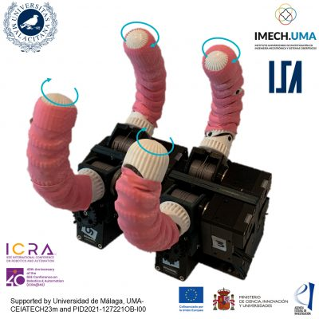

## Augmented manipulation skills of adaptive grippers with active rolling fingers for pHRI and industry

### Short abstract of the demo

This demo showcases the manipulation skills of a novel gripper with 2-DoFs adaptive underactuated fingers. While the first one controls the conventional opening and closing of the fingers, the second confers each finger’s additional axial rotation motion. Compared to other robotic grippers, this extra DoF augments its manipulation skills and allows for single-arm and single-grasp tasks that usually require multi-grasping, bimanual manipulation, or complex planning and control strategies. This design is particularly beneficial for physical human-robot interaction, particularly for human limb manipulation, as shown in this demo. Two showcases are presented to demonstrate the gripper’s capabilities: manipulation of everyday objects and sleeve rolling, which is a common task in nursing and first response environments, where direct access to the skin of the distal forearm of the human is needed to measure vital signals or perform medical procedures.

### Presenters

Juan M. Gandarias and Jesús M. Gómez-de-Gabriel

### Video

<video width="360" height="240"  controls>
  <source src="video.mp4" type="video/mp4">
</video>